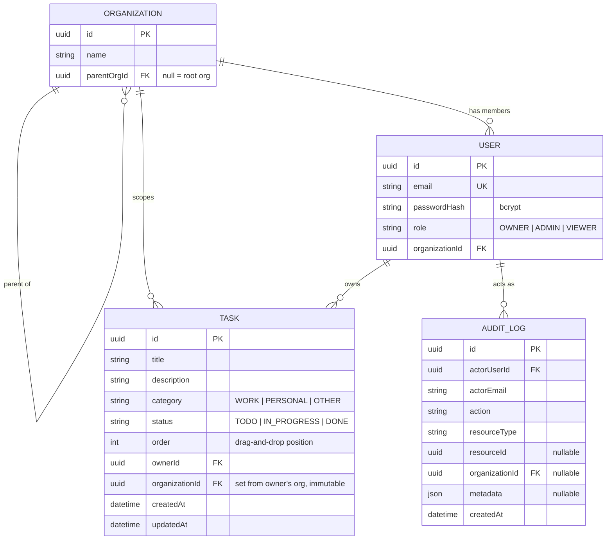

# Secure Task Management System

A role-based, organization-scoped task manager built for the TurboVets full-stack
coding challenge. NX monorepo: NestJS API + TypeORM/SQLite, Angular dashboard,
two shared libraries.

**Live demo:** https://turbovets-task-dashboard-missa.pages.dev
**Video walkthrough:** _TODO — link here before submitting_

---

## Trying the live demo

No setup needed — just open the dashboard and log in:

**https://turbovets-task-dashboard-missa.pages.dev**

### Login credentials

All four accounts share the password `Password123!`. Each demonstrates a
different part of the access-control model — logging into more than one is
the fastest way to see the RBAC/org-scoping actually working, not just
described:

| Email                 | Role   | Organization            | What it shows                                                                                                                                          |
| --------------------- | ------ | ----------------------- | ------------------------------------------------------------------------------------------------------------------------------------------------------ |
| `owner@acme.test`     | OWNER  | Acme Corp (root)        | Sees/manages tasks across the **entire org tree** — Acme Corp and Engineering                                                                          |
| `admin@acme.test`     | ADMIN  | Acme Corp (root)        | Sees/manages root + Engineering (an Admin's scope reaches into sub-orgs below them)                                                                    |
| `admin.eng@acme.test` | ADMIN  | Acme Corp / Engineering | Scoped to Engineering **only** — log in right after `admin@acme.test` to see an Admin seated at a sub-org has no visibility upward into the parent org |
| `viewer@acme.test`    | VIEWER | Acme Corp / Engineering | Read-only — no create/edit/delete controls anywhere, no "Audit Log" link in the header                                                                 |

### A quick tour, if useful

- Create, edit, drag-and-drop reorder, or delete a task (as any role except Viewer)
- Log in as `viewer@acme.test` and confirm there's genuinely nothing to click to mutate a task
- Open **Audit Log** (top right, Owner/Admin only) — every action taken above shows up there, scoped to what that role can see
- Toggle dark/light mode (top right) and try the keyboard shortcuts: `n` for a new task, `/` to focus the search box
- Try hitting `https://turbovets-task-api-missa.fly.dev/api/tasks` directly without a token — confirms the API rejects unauthenticated requests, not just the UI hiding buttons

### Two things worth knowing before you start

- **First request may be slow.** The API runs on Fly.io's free trial tier,
  which caps continuous uptime at 5 minutes per boot (a Fly account
  restriction, unrelated to the app itself). If it's been idle, the first
  login or task load after that can take a few extra seconds while it
  restarts — not a bug, no refresh needed, it resolves on its own.
- **It's a real shared instance.** Since it's genuinely live (not a mockup),
  data can be changed by anyone testing it, including you. If it looks messy
  by the time you look at it, that's expected — the seed data can be reset
  any time (see [Deployment](#deployment)).

---

## Table of contents

- [Trying the live demo](#trying-the-live-demo)
- [Setup instructions](#setup-instructions)
- [Architecture overview](#architecture-overview)
- [Data model](#data-model)
- [Access control implementation](#access-control-implementation)
- [API documentation](#api-documentation)
- [Testing](#testing)
- [Deployment](#deployment)
- [Tradeoffs and unfinished areas](#tradeoffs-and-unfinished-areas)
- [Future considerations](#future-considerations)

---

## Setup instructions

### Prerequisites

- Node.js 20+ and npm
- Nothing else — SQLite is file-based, no external database to install

### 1. Install dependencies

```bash
npm install
```

### 2. Configure environment

```bash
cp .env.example .env
```

The defaults work as-is for local dev. Variables:

| Variable                 | Purpose                                                 | Dev default              |
| ------------------------ | ------------------------------------------------------- | ------------------------ |
| `JWT_SECRET`             | Signs/verifies access tokens                            | a placeholder dev string |
| `JWT_EXPIRES_IN_SECONDS` | Access token lifetime, in seconds                       | `900` (15 minutes)       |
| `DB_PATH`                | Path to the SQLite file, relative to the workspace root | `data/db.sqlite`         |
| `API_PORT`               | Port the NestJS api listens on                          | `3000`                   |
| `CORS_ORIGIN`            | Comma-separated origins allowed to call the api         | `http://localhost:4200`  |

> `API_PORT`, not `PORT`: Nx auto-loads `.env` for **every** task it runs, including
> `nx serve dashboard`. A generic `PORT` would leak into Angular's dev server too
> and collide with the api on the same port — found this the hard way while testing.

### 3. Seed demo data

```bash
npm run seed
```

Creates a small org tree and one user per role/org-position combination that
matters for testing scope rules:

| Email                 | Role   | Organization            | Why this account exists                                  |
| --------------------- | ------ | ----------------------- | -------------------------------------------------------- |
| `owner@acme.test`     | OWNER  | Acme Corp (root)        | Sees/manages the entire tree                             |
| `admin@acme.test`     | ADMIN  | Acme Corp (root)        | Sees/manages root + Engineering                          |
| `admin.eng@acme.test` | ADMIN  | Acme Corp / Engineering | Scoped to Engineering only — proves no upward visibility |
| `viewer@acme.test`    | VIEWER | Acme Corp / Engineering | Read-only, Engineering only                              |

All four share the password `Password123!` (shown on the login screen too). The
script is idempotent — re-run it any time to reset to this state.

### 4. Run the api and the dashboard

Two terminals, from the workspace root:

```bash
npx nx serve api         # → http://localhost:3000/api
npx nx serve dashboard   # → http://localhost:4200
```

Open `http://localhost:4200`, log in with any account above.

### 5. Run tests

```bash
npx nx test auth        # libs/auth — RBAC core logic (20 tests)
npx nx test api          # apps/api (21 tests)
npx nx test dashboard    # apps/dashboard (19 tests)
```

### Pre-commit hooks

Husky + lint-staged run ESLint (`--fix`) and Prettier on staged files on every
commit. Installed automatically via `npm install` (the `prepare` script).

---

## Architecture overview

```
apps/
  api/         NestJS backend — TypeORM + SQLite, JWT auth, RBAC-guarded REST API
  dashboard/   Angular frontend — signals-based state, Tailwind, drag-and-drop board

libs/
  data/        Shared enums, wire-shape interfaces, and DTOs
  auth/        RBAC core logic (role rank, permission mapping, org-scope resolution)
               + the NestJS decorators/guards that wrap it
```

### Why this split

**`libs/data`** is the single source of truth for what a `Task`, `Organization`,
`User`, `Role`, `Permission`, etc. _look like_ on the wire. Both apps import from
here, so the frontend and backend can never quietly drift apart on field names or
enum values — a `Task.status` typo would be a compile error, not a runtime bug
discovered in QA.

**`libs/auth`** is the single source of truth for what those shapes _mean_ —
role inheritance, which permissions a role has, and which org IDs an actor can
reach. This is the highest-stakes code in the whole assessment (RBAC correctness
is the top-weighted evaluation criterion), so it's built as plain, dependency-free
TypeScript functions (`roleAtLeast`, `roleHasPermission`, `getAccessibleOrgIds`)
with NestJS decorators/guards (`@RequirePermission`, `PermissionsGuard`,
`@Public`) as a thin wrapper on top. The pure functions are unit-tested directly,
with no Nest bootstrap, no mocking a framework — just inputs and outputs.

### The `/browser` and `/core` split

Both shared libs actually have **two** entry points each, and this was not the
original plan — it's a fix for a real bug I found while wiring the frontend up
(see [Tradeoffs](#tradeoffs-and-unfinished-areas) for the full story). Short
version: `libs/data`'s DTO classes carry `class-validator` decorators for
NestJS's `ValidationPipe`, and `libs/auth`'s guards import `@nestjs/common`.
Decorator metadata isn't tree-shakeable, so importing the "everything" barrel
from Angular pulled the whole `class-validator` + `@nestjs/*` dependency graph
into the browser bundle — ~70KB and dozens of build warnings for code the
frontend never touches.

- `@app/data` / `@app/auth` — the full barrel, everything included. **apps/api**
  uses these.
- `@app/data/browser` / `@app/auth/core` — framework-free subset (enums, plain
  interfaces, and the pure RBAC functions only). **apps/dashboard** uses these
  exclusively. A grep of the built output confirms zero `class-validator` or
  `@nestjs/*` code reaches the browser bundle.

This means `roleHasPermission()` — the exact function `PermissionsGuard` calls
server-side — also drives which buttons the Angular UI shows. One
implementation, two consumers, not two independently-maintained copies that
could drift.

### apps/api module layout

```
src/
  entities/        TypeORM entities (Organization, User, Task, AuditLog)
  auth/             Login, JWT strategy/guard, bcrypt
  organizations/    Internal org-tree access + OrgScopeService (no public endpoints)
  tasks/            CRUD, permission + org-scope enforcement
  audit/            Write-side (AuditService.log) + read-side (GET /audit-log)
  seed.ts           Standalone demo-data script (not part of the Nest app)
```

`OrgScopeService` lives in `organizations/`, not `tasks/`, even though it's
conceptually closest to tasks — both `TasksModule` and `AuditModule` need it
(audit log visibility is scoped the same way task visibility is), and putting it
in either one would create a circular module import.

### apps/dashboard structure

```
src/app/
  core/
    auth/    AuthService (signals), interceptor, route guards
    api/     Thin HTTP wrappers (TasksApiService, AuditApiService)
    state/   TasksStore (signals-based store), ThemeService
  features/
    login/
    dashboard/    Task board, task-card, task-form dialog, completion chart
    audit-log/
```

**State management:** plain Angular signals + `computed()` in a single
`TasksStore` injectable, not NgRx. At this app's size, actions/reducers/effects
would be ceremony without payoff — a signal for the source-of-truth array and a
few `computed()` views (filtered, grouped-by-status, completion stats) give the
same "derived state updates automatically" behavior NgRx provides, with far
less code to read.

---

## Data model



- **Organization** is self-referential and capped at 2 levels by application
  logic (not a DB constraint): `parentOrgId IS NULL` marks a root; any org whose
  parent is itself a sub-org would violate the model, so the seed script (the
  only thing that creates orgs today) never does that.
- **Task.organizationId** is set once, at creation, from the creating user's own
  `organizationId` — never from client input. This is what makes org-scoping
  trustworthy: a task can't be created "into" another org by sending an
  arbitrary `organizationId` in the request body (the DTO doesn't even accept
  one).
- **AuditLog.actorUserId** is an empty string, not null, when a login attempt
  fails against an email that matches no account — there's no real actor to
  attribute it to, but the attempted email is still recorded in `actorEmail` for
  security visibility.

---

## Access control implementation

RBAC here is **two independent axes**, not one role check:

### Axis 1 — Role → capability (what an actor can do)

Rank-based inheritance: **Owner (3) > Admin (2) > Viewer (1)**. Each tier's
permission set is defined as the tier below it, plus what that role adds — the
inheritance is structural (`ADMIN_PERMISSIONS = [...VIEWER_PERMISSIONS, ...]`),
not just a comment claiming it exists.

| Role   | Permissions                                                 |
| ------ | ----------------------------------------------------------- |
| VIEWER | `TASK_READ`                                                 |
| ADMIN  | + `TASK_CREATE`, `TASK_UPDATE`, `TASK_DELETE`, `AUDIT_READ` |
| OWNER  | same set as Admin — see note below                          |

**Why Owner has no Admin+1 permission type:** the assessment's endpoint surface
has no org/user-management API, so there's nothing extra for Owner to _do_ in
this scope. The inheritance mechanism is still real and tested (`roleAtLeast`,
rank comparison) — it just isn't independently observable at this endpoint
count. Owner's actual distinction is entirely on the second axis:

### Axis 2 — Org position → scope (what an actor can see/touch)

`getAccessibleOrgIds(actor, orgs)` in `libs/auth/src/lib/org-scope.ts`:

- **Viewer** — exactly their own org node. No breadth at all.
- **Admin** — their own org node _plus its direct sub-orgs_ (downward only — an
  Admin seated at a sub-org cannot see the parent org's tasks).
- **Owner** — the _entire tree_ containing their org (root + all sub-orgs),
  regardless of which node they personally sit in.

This is what makes Owner genuinely "have full org control" as the spec asks
for, while Admin stays strictly narrower — a real, testable difference, not
just a label. It's demonstrated directly by the seed data:
`admin.eng@acme.test` (Admin, seated at the Engineering sub-org) cannot see
Acme Corp root's tasks, while `admin@acme.test` (Admin, seated at the root)
can see both.

### How the two axes combine, end to end

1. **Authentication** — `POST /auth/login` verifies the bcrypt hash, issues a
   JWT whose payload is `{ sub, email, role, organizationId }`. `JwtAuthGuard`
   is registered globally (`APP_GUARD`), so every route requires a valid token
   by default; `@Public()` is the explicit, auditable opt-out (used only by
   the login route itself).
2. **Role/permission check** — `@RequirePermission(Permission.TASK_UPDATE)` on
   a route + `PermissionsGuard` reading it. This runs _after_ `JwtAuthGuard`
   (guard registration order matters — see `AppModule`), so `request.user` is
   already populated. A Viewer never reaches `TasksController.update()` at all.
3. **Ownership/org-scope check** — `PermissionsGuard` only knows the actor's
   _role_, not which org a specific `:id` belongs to, so resource-specific
   scoping happens in `TasksService.findAccessibleOrThrow()`: fetch the task,
   compute the actor's accessible org IDs, and check membership. **Returns 404
   for both "task doesn't exist" and "task exists but is outside your org
   scope"** — deliberately not 403 for the latter, so a response-code
   difference can't be used to enumerate which task IDs belong to other
   organizations.
4. **Audit logging** — every create/update/delete/list, every login and login
   failure, and every access-denial writes an `AuditLog` row (persisted to
   SQLite, mirrored to the console). Denials from `PermissionsGuard`
   (role-level) and from `TasksService` (org-scope-level) are logged at the
   point each decision is actually made, not centrally — each layer has the
   context to explain _why_ it denied, right where it denies.
5. **GET /audit-log** is itself scoped by the same `getAccessibleOrgIds` rule
   task visibility uses — an Admin only sees audit entries for orgs within
   their own reach, not every org in the system.

### Ownership

Every task records `ownerId` and an immutable `organizationId` at creation.
Mutation rights are gated by **role + org-scope**, not "did I create this" —
the spec is explicit that Viewers must not mutate, even their own tasks, so
ownership isn't a bypass. Ownership is used for audit attribution and the
"created by" context in the data model; the org-scope check is structurally
tied to it (a task's org is always its owner's org at creation time), which is
what makes org-scoping trustworthy rather than just self-reported.

### Security hardening (post-build audit)

After the core feature set was done, a full pass looking specifically for
security gaps turned up four worth fixing before calling this finished:

- **Login timing attack (user enumeration)** — `AuthService.validateCredentials`
  used to return immediately for an unknown email, skipping the (slow)
  `bcrypt.compare` call that a real account would trigger. That timing gap is
  a side-channel: an attacker can tell "no such account" from "wrong password"
  just by measuring response time. Fixed by always running `bcrypt.compare`
  against something — a real hash, or a precomputed dummy one — so both paths
  take the same time.
- **No rate limiting on `/auth/login`** — added `@nestjs/throttler`: a
  generous global default (100 req/min/IP) plus a strict override on the
  login route specifically (5 attempts/min/IP), since that's the one endpoint
  worth brute-forcing.
- **Missing security headers** — added `helmet()` to the bootstrap, giving
  every response a Content-Security-Policy, HSTS, X-Frame-Options,
  X-Content-Type-Options, etc.
- **Docker container ran as root** — the api's Dockerfile now creates an
  unprivileged `nestjs` user and drops to it via a `gosu`-based entrypoint
  script. Root is still needed for one step — the Fly volume mounts owned by
  root regardless of image config, so its ownership has to be fixed before the
  app can write `db.sqlite` to it — but the actual Node process never runs as
  root. Verified on the live deployment: the app's PID shows `Uid: 1001`, not
  `0`.

All four verified against the live deployment, not just locally: rate-limit
headers and a real 429 after 5 rapid login attempts, `helmet`'s headers
present on every response, and the non-root UID confirmed via `fly ssh
console`.

**Known, accepted risk:** this is a live, public demo with credentials
published on the login screen and in this README (`Password123!` for all
four seeded accounts, including an `OWNER`). That's intentional — TurboVets
needs to log in too — but it does mean anyone who finds the URL can log in
with full org control and alter the seeded data. Worth re-seeding
(`npm run seed`, or `fly ssh console -C "node seed.js"` against the live
instance) before a demo if the data's gotten messy.

### Second pass: three more findings

A follow-up review turned up three more (lower-severity) gaps. Two are fixed;
one is intentionally deferred rather than shipped half-verified:

- **CORS `credentials: true` was unnecessary** — auth is a Bearer token sent
  explicitly by our own `HttpClient` code, not a cookie the browser attaches
  automatically, so credentialed CORS added attack surface for no benefit.
  Removed from `main.ts`.
- **Docker image shipped its C compiler toolchain** — `python3`/`make`/`g++`
  (needed only to compile `better-sqlite3` and `bcrypt`'s native bindings)
  were installed directly in the runtime stage, so they shipped in the final
  image. Split into a separate `deps` build stage that's discarded after
  `npm ci` — only its already-compiled `node_modules` gets copied into the
  final image. Verified: image size dropped from 185MB to 91MB, and DB
  read/write (login, task create) both still work against the live volume
  after the rebuild.
- **No security headers on the Cloudflare Pages frontend** — added a
  `public/_headers` file (same mechanism as `_redirects`). Five headers ship
  and are verified live: `X-Frame-Options`, `X-Content-Type-Options`,
  `Referrer-Policy`, `Permissions-Policy`, `Strict-Transport-Security`. A
  sixth, **Content-Security-Policy, is deliberately not shipped**: adding it
  reliably broke Tailwind's styling in testing (page rendered with correct
  DOM/text but zero applied styles), and debugging why consumed a lot of
  back-and-forth without a conclusive root cause — the failure pattern didn't
  fully match how CSP directives are specified to behave (e.g. a single
  `style-src` directive worked alone, but adding directives that shouldn't
  interact with it at all, like `script-src`, broke it too), and some earlier
  test results turned out to be a stale-cache artifact on the production
  domain rather than a real signal, which muddied the diagnosis further.
  Rather than ship a CSP of uncertain correctness — or worse, one that's
  silently broken — this is left as a documented follow-up. The api's own
  `helmet`-issued CSP (see above) is unaffected and live.

---

## API documentation

Base URL: `http://localhost:3000/api`. All routes except `/auth/login` require
`Authorization: Bearer <token>`.

### `POST /auth/login`

```bash
curl -X POST http://localhost:3000/api/auth/login \
  -H "Content-Type: application/json" \
  -d '{"email":"admin@acme.test","password":"Password123!"}'
```

```json
{
  "accessToken": "eyJhbGciOiJIUzI1NiIs...",
  "user": { "sub": "…", "email": "admin@acme.test", "role": "ADMIN", "organizationId": "…" }
}
```

`401 Unauthorized` on any bad credential — deliberately the same response for
"no such email" and "wrong password" (see [Data model](#data-model)).

### `POST /tasks`

Requires `TASK_CREATE` (Admin, Owner).

```bash
curl -X POST http://localhost:3000/api/tasks \
  -H "Authorization: Bearer $TOKEN" -H "Content-Type: application/json" \
  -d '{"title":"Review Q3 numbers","category":"WORK"}'
```

```json
{ "id": "…", "title": "Review Q3 numbers", "category": "WORK", "status": "TODO", "order": 0, "ownerId": "…", "organizationId": "…", "createdAt": "…", "updatedAt": "…" }
```

### `GET /tasks`

Requires `TASK_READ` (all roles). Returns only tasks within the caller's
accessible org scope — see [Access control](#access-control-implementation).

```bash
curl http://localhost:3000/api/tasks -H "Authorization: Bearer $TOKEN"
```

### `PUT /tasks/:id`

Requires `TASK_UPDATE` (Admin, Owner) **and** the task must be within the
caller's org scope (404 otherwise).

```bash
curl -X PUT http://localhost:3000/api/tasks/$TASK_ID \
  -H "Authorization: Bearer $TOKEN" -H "Content-Type: application/json" \
  -d '{"status":"DONE"}'
```

### `DELETE /tasks/:id`

Requires `TASK_DELETE` (Admin, Owner) + org scope, same rule as `PUT`. Returns
`204 No Content`.

### `GET /audit-log`

Requires `AUDIT_READ` (Admin, Owner only). Scoped to the caller's accessible
orgs, newest first, capped at 200 rows.

```bash
curl http://localhost:3000/api/audit-log -H "Authorization: Bearer $TOKEN"
```

```json
[{ "id": "…", "actorUserId": "…", "actorEmail": "admin@acme.test", "action": "TASK_UPDATE", "resourceType": "task", "resourceId": "…", "organizationId": "…", "metadata": { "fields": ["status"] }, "createdAt": "…" }]
```

---

## Testing

60 tests total, weighted toward the highest-graded area per the assessment
brief (RBAC/auth correctness over frontend coverage):

| Project          | Tests | What's covered                                                                                                                                                                                                                                                                                                                   |
| ---------------- | ----- | -------------------------------------------------------------------------------------------------------------------------------------------------------------------------------------------------------------------------------------------------------------------------------------------------------------------------------- |
| `libs/auth`      | 20    | Role rank/inheritance, permission mapping, org-scope resolution (all pure functions, no framework), `PermissionsGuard`                                                                                                                                                                                                           |
| `apps/api`       | 21    | `AuthService` (credential validation, token issuance), `JwtAuthGuard`'s `@Public()` bypass, `OrgScopeService`, `AuditService`, and `TasksService` — the centerpiece: proves `organizationId`/`ownerId` always derive from the authenticated actor, cross-org mutation returns 404 + logs `ACCESS_DENIED`, and org-scoped listing |
| `apps/dashboard` | 19    | `TasksStore`'s filter/sort/grouping logic, `AuthService` session persistence, `authInterceptor` (including a real bug it caught — see below)                                                                                                                                                                                     |

Also manually smoke-tested end-to-end in a live browser across all 4 seeded
roles: login, org-scoped task visibility (including the sub-org Admin's lack
of upward visibility), role-gated mutation, drag-and-drop persistence, audit
log visibility and role-gating, dark mode, and keyboard shortcuts.

**A real bug this caught:** the `authInterceptor` test found that
`inject(Router)` was called inside an RxJS `catchError` callback, which runs
outside Angular's synchronous injection context — `inject()` there throws, so
a 401 response would silently fail to redirect to `/login` in the real app.
Fixed by injecting `Router` at the top of the interceptor, same pattern as
`AuthService`.

---

## Deployment

- **API** — Docker image on [Fly.io](https://fly.io), `apps/api/Dockerfile`
  (multi-stage: builds via `nx build api`, native `better-sqlite3` compiled
  in the runtime stage). A persistent Fly volume mounted at `/data` holds the
  SQLite file across restarts/redeploys. Config in `fly.toml` at the
  workspace root. `min_machines_running = 1` — deliberately always-on for
  the duration of this assessment, so a reviewer never sees a cold-start
  delay; easy to flip back to auto-stop afterward.
- **Dashboard** — static build on Cloudflare Pages (`apps/dashboard`'s
  production build, `environment.prod.ts` points at the Fly URL above).
  `public/_redirects` (`/* /index.html 200`) makes client-side routing work
  on direct navigation/refresh, not just in-app links.
- **Seeding the live database** — `apps/api/src/seed.ts` is built as its own
  self-contained webpack bundle (`nx run api:build-seed`, see
  `webpack.seed.config.js`) and shipped in the same Docker image as `seed.js`,
  so it can be re-run against the live volume any time via
  `fly ssh console -C "node seed.js"` without needing a separate build or
  redeploy.

**A real deployment bug this surfaced:** TypeORM loads its SQLite driver via
a dynamic `require('better-sqlite3')` keyed off a config string, not a static
import — so webpack's dependency analysis (and its `generatePackageJson`
output) never saw it, and the first deploy would have shipped without it
installed. Caught by inspecting the generated `dist/apps/api/package.json`
before deploying, not by a failed deploy. Fixed via
`NxAppWebpackPlugin`'s `runtimeDependencies` option (same fix needed for
`dotenv`, imported as `dotenv/config` — a subpath the same heuristic misses).

---

## Tradeoffs and unfinished areas

Collected as they came up during the build, not reconstructed afterward:

- **`synchronize: true` instead of TypeORM migrations.** Fast local iteration;
  a real deployment would use migrations so schema changes are reviewed and
  reversible. `TODO(tradeoff)` comment left at the point of use in
  `AppModule`.
- **No user registration or user-management endpoints.** The spec's endpoint
  list has none, so demo accounts come from the seed script only. Real
  onboarding (self-registration, invites, org creation) is out of scope here.
- **Owner has no Admin+1 permission type**, only wider org scope — see
  [Access control](#access-control-implementation) for the reasoning. If a
  future endpoint needed an Owner-only capability, `OWNER_PERMISSIONS` in
  `libs/auth/src/lib/role-permissions.ts` is already its own array, ready for
  an addition.
- **Audit log excludes entries with no organization** (a login attempt against
  an email matching no account has nowhere to scope to). A true system-wide
  audit view for these would need a separate "global" permission tier not
  built for this assessment. `TODO(tradeoff)` comment at the point of use.
- **JWT stored in `localStorage`**, not an `httpOnly` cookie — simpler for a
  pure Bearer-token API with no server-rendered pages, but XSS-exposed in a
  way a cookie wouldn't be. Documented, not fixed — see
  [Future considerations](#future-considerations).
- **Drag-and-drop reordering makes one `PUT` per changed task**, not a single
  batch-reorder call. Fine at the seed data's scale; a real reorder endpoint
  (`PATCH /tasks/reorder` accepting an ordered ID list) would be one round
  trip instead of N.
- **No optimistic locking / conflict detection.** Two users editing the same
  task concurrently is last-write-wins. Not addressed.
- **No pagination** on `GET /tasks` or `GET /audit-log` — capped at 200 rows
  for the audit log, unbounded for tasks. Fine at demo scale.
- **The `apps/dashboard` window-resize/mobile-layout check wasn't verified in
  an actual live browser** — the Tailwind classes are written mobile-first
  (`grid-cols-1 sm:grid-cols-2 lg:grid-cols-3`, `flex-wrap` header, etc.) and I
  believe they're correct, but a browser-automation tool limitation in my dev
  environment prevented resizing the viewport to confirm visually. Worth a
  30-second manual check before recording the video.

---

## Future considerations

As asked for in the assessment brief:

- **Advanced role delegation** — today's three roles are fixed and global per
  organization. A production system would likely want per-org custom roles or
  delegated admin scopes (e.g. "Admin for Engineering only" as an explicit
  grant, not implied by where a user's `organizationId` happens to point).
- **JWT refresh tokens** — the 15-minute access token has no refresh flow;
  the user just has to log in again. A refresh token (long-lived, rotated,
  stored server-side or in an `httpOnly` cookie) would let the access token
  stay short without constant re-login.
- **CSRF protection** — not currently needed, since auth is a Bearer token in
  a header (not a cookie), which isn't automatically attached by the browser
  to cross-site requests the way a cookie is. This changes if the JWT
  storage move above (to an `httpOnly` cookie) ever happens — CSRF protection
  would become necessary at that point, not before.
- **RBAC caching** — `roleHasPermission`/`getAccessibleOrgIds` run fresh on
  every request against small in-memory maps and an org-table query. Fine at
  this scale; at volume, the org tree (which changes rarely) is an obvious
  cache candidate, keyed by root org ID with short TTL or explicit
  invalidation on org mutation.
- **Efficient scaling of permission checks** — `OrgScopeService` loads the
  _entire_ organizations table on every scoped request
  (`OrganizationsService.findAll()`) to compute one actor's accessible IDs.
  Fine for a handful of orgs; at real scale this should be a targeted query
  (fetch the actor's org + its parent/children directly) rather than loading
  everything and filtering in memory.
